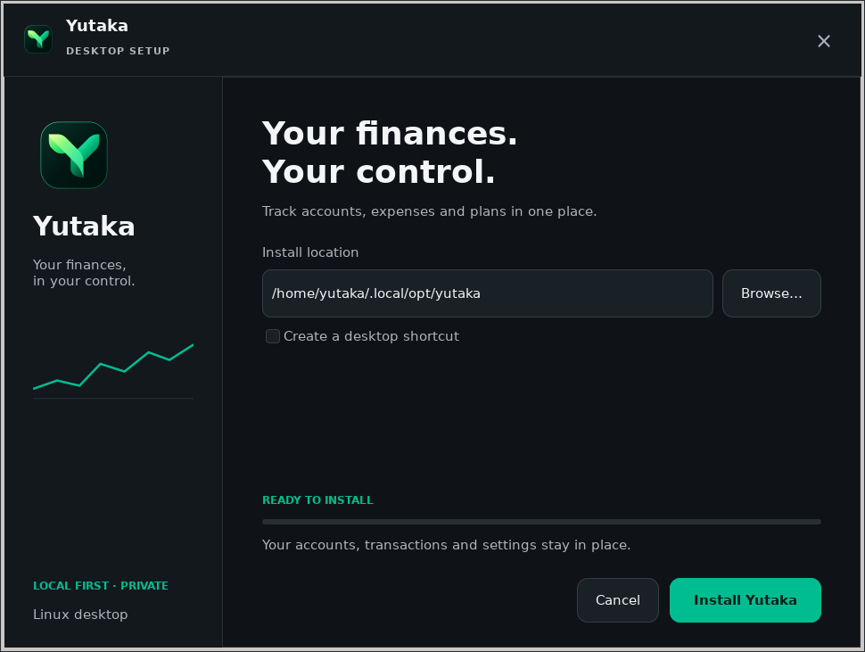

# Yutaka desktop installers

The artwork uses the real `assets/icons/app_icon.png`, charcoal background
`#0F1216`, surface `#13181D`, outline `#272F35`, muted text `#ADB5BB`, and
Yutaka green `#00BD91`, matching `lib/app_config.dart`.

Actual Linux installer preview:



- **Windows:** `windows/yutaka.iss` builds a custom header, branded sidebar and
  welcome/progress/completion screen around Inno Setup 6.7+ native dark controls.
  Folder selection and optional desktop shortcuts are inline. Inno retains its
  installation engine, prerequisites, close-app choices, stable app ID and
  uninstall support. CI signs the executable before packaging and the setup file
  afterward when certificates are configured.
- **Linux:** `linux/setup.c` provides the matching GTK 3 layout with the real app
  icon, finance sidebar, green action button, folder selector, optional desktop
  shortcut, progress, failure/retry and Launch Yutaka completion. Busy setup blocks
  closing, and reduced motion disables its spinner. `linux/install.sh` installs the bundled AppImage for the
  current user and replaces it atomically; it never deletes app data or the chosen
  folder. `linux/build.py` embeds the UI, backend and AppImage in a self-extracting
  `.run` file with a SHA-256 corruption check. GTK 3 is only needed for the GUI;
  Bash, tar and sha256sum are required for terminal setup. The normal AppImage and
  portable archive remain available. In-app updates prefer the custom setup for
  the current architecture and retain AppImage/archive fallback for older releases.
- **macOS:** `macos/main.swift` provides a matching small native AppKit setup app,
  compiled for both Apple Silicon and Intel by `macos/build.py`. The DMG opens
  `Yutaka Setup.app`; the app update flow mounts it and opens setup directly.
  `macos/install.sh` verifies the embedded ZIP checksum and app code signature,
  stages the entire bundle and restores the prior app if the final move fails.
  It changes only `Yutaka.app`, preserves user data, and uses a folder lock to
  prevent concurrent installs. Setup asks a running Yutaka to quit normally.
  CI separately signs/notarizes setup when credentials are available, tests the
  backend on macOS and launches the UI check from the mounted DMG. The portable
  ZIP still contains the main app directly.

Generated artwork is checked in, so release runners need no image-rendering
dependencies. To regenerate it, install Pillow and Inter or DejaVu Sans, then run:

```bash
python3 tools/installers/render_branding.py
```

Run installer regression tests without Flutter:

```bash
python3 -m unittest discover -s tools/installers/tests -p 'test_*.py' -v
```

Build and check the native Linux UI on a machine with GTK 3 development packages,
GCC, pkg-config, Xvfb and xauth:

```bash
gcc -std=c11 -O2 -Wall -Wextra -Werror tools/installers/linux/setup.c \
  -o /tmp/yutaka-setup $(pkg-config --cflags --libs gtk+-3.0 gio-2.0)
mkdir -p /tmp/yutaka-setup-payload
cp assets/icons/app_icon.png /tmp/yutaka-setup-payload/icon.png
NO_AT_BRIDGE=1 G_DEBUG=fatal-warnings xvfb-run -a \
  /tmp/yutaka-setup /tmp/yutaka-setup-payload --check-ui
NO_AT_BRIDGE=1 G_DEBUG=fatal-warnings xvfb-run -a \
  python3 tools/installers/tests/check_linux_gui.py \
  --setup /tmp/yutaka-setup --icon assets/icons/app_icon.png
```

For the UI check, the payload folder should contain `icon.png`; CI prepares this
folder. No installation occurs during `--check-ui`.

The GUI regression check uses temporary HOME and XDG folders, a tiny fixture app,
and XTest keyboard events to check install, busy-close protection, failure/retry,
completion and data preservation. It requires the X11/XTest runtime libraries.
macOS backend tests automatically skip on other operating systems. Windows and
macOS compilation and native setup validation run on their platform CI runners.
